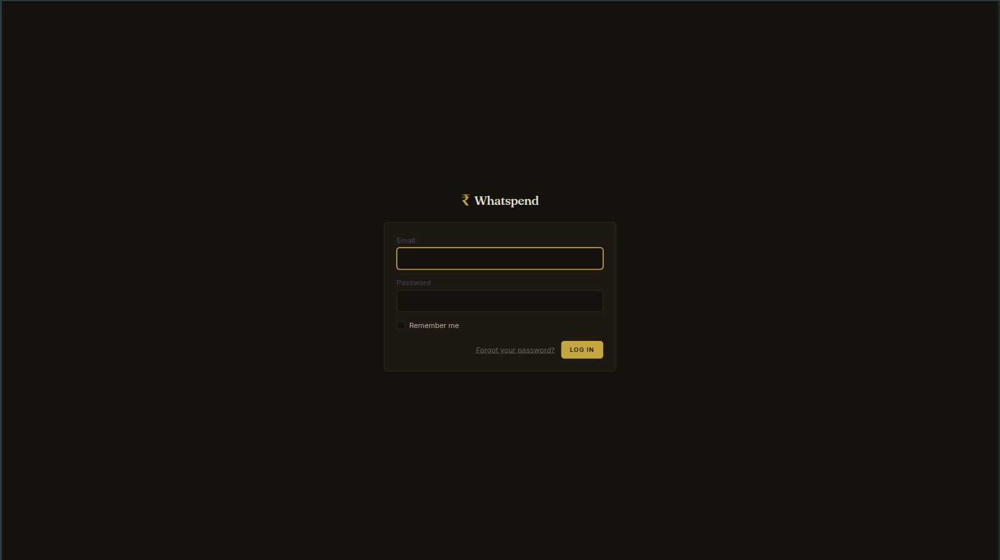
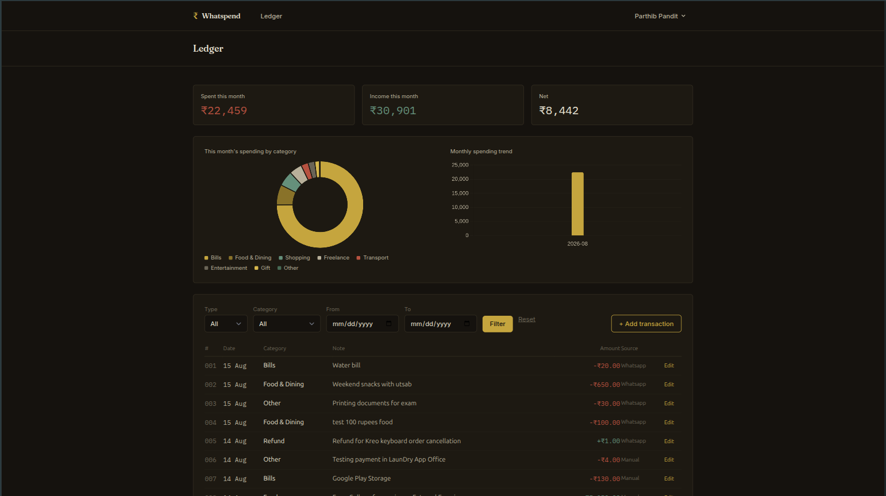

# Whatspend

**Personal finance, texted in.**

Log an expense the way you already talk about money — over WhatsApp. Send "420 for groceries" and it's in your ledger. No app to open, no form to fill. Whatspend parses what you send with Claude, keeps a running dashboard, and sends daily/weekly summaries automatically — all built on Laravel.


---

## What it does

Whatspend is a multi-user (admin-approved, ~10-15 people) expense tracker with two ways in: free-text WhatsApp messages parsed into structured transactions by Claude, or manual entry on a web dashboard. Beyond logging, it supports natural-language spend queries ("how much did I spend on food this month?", "compare this month with last"), conversational edits and deletes ("actually make that ₹850", "delete the ₹500 grocery one from Tuesday"), on-demand PDF/CSV statement delivery straight to WhatsApp, monthly budget alerts, and recurring-expense detection — all without a single agentic tool-calling loop. The LLM only ever extracts structure; Laravel owns every number and every decision.

Built as a deep-dive into Laravel (auth, queues, scheduling, jobs, API clients) and as a portfolio piece, with a hard constraint of staying near-zero cost to run.

---

## Screenshots

**Landing page**


**Login**


**Dashboard — ledger, filters, category & trend charts**


**WhatsApp — requesting and receiving a PDF statement**


---

## Architecture overview

```
WhatsApp message
      │
      ▼
Meta Cloud API webhook (POST /webhook/whatsapp)
      │  verify signature, resolve User by phone, log to whatsapp_messages
      ▼
InboundMessageRouter
      │  routes by intent: pending confirmation? undo/edit? transaction
      │  action (edit/delete)? statement request? spend query? or a
      │  brand-new transaction to parse?
      ▼
Claude Haiku (via laravel/ai)     ← extracts structure ONLY
      │  { type, amount, category, note, confidence }
      ▼
Laravel                            ← owns all computation & business logic
      │  saves Transaction, runs aggregation queries, checks budgets,
      │  generates statements, formats replies
      ▼
WhatsAppClient → outbound reply / document
```

The same "LLM extracts, Laravel computes" pattern is used everywhere an LLM appears — transaction parsing, query-intent extraction, statement-request parsing, narrative summaries. The model never touches a number it didn't first receive from Laravel already computed.

A single `conversation_contexts` table (built once, reused repeatedly) tracks short-lived state — an unconfirmed low-confidence parse awaiting YES/NO, the most recent transaction for undo/edit, a pending confirm-before-delete — so multi-turn corrections work without bespoke state machines per feature.

---

## Key design decisions

- **LLM extracts, Laravel computes.** Every dollar amount, every aggregation, every budget check is deterministic backend logic. The LLM's job stops at turning free text into structured JSON (with a confidence score) — it never generates or touches a figure that ends up in a reply.
- **Filter-based ("Tier 1") search over semantic search.** Natural-language queries are parsed into structured filter JSON (category, date range, amount bounds) and run as ordinary Eloquent queries. This covers the large majority of realistic questions without the ongoing cost and complexity of embeddings + a vector index at write-time.
- **No agentic tool-calling loops.** Every LLM call is single-shot: one prompt in, one structured response out. No multi-step "decide which tool, evaluate, decide again" loops — keeps cost, latency, and auditability predictable on a WhatsApp-speed interface.
- **Confidence-gated auto-save.** High-confidence parses (`≥ 0.7`) save immediately with a frictionless confirmation reply. Low-confidence parses ask an explicit YES/NO rather than guessing.
- **Fuzzy targeting never auto-mutates.** "Delete the ₹500 grocery one from Tuesday" locates candidates via the same query service used for spend questions — exactly one match triggers a confirm-before-delete step; zero or multiple matches always ask the user to clarify, never guess.

---

## Tech stack

| Layer | Choice |
|---|---|
| Framework | Laravel 12.x |
| Language | PHP 8.3+ |
| Database | MySQL |
| Queue | `database` driver, drained via cron (`queue:work --stop-when-empty`) |
| Scheduler | Laravel Task Scheduling, single cron entry (`schedule:run`) |
| Auth | Laravel Breeze (session-based) |
| LLM | Claude Haiku 4.5, via `laravel/ai` |
| WhatsApp | Meta WhatsApp Cloud API (direct, no BSP) |
| Charts | Chart.js via CDN |
| Statements | `barryvdh/laravel-dompdf` (PDF), native CSV export |
| Hosting | Shared hosting, cron-driven queue/scheduler |

---

## Setup / local development

```bash
git clone https://github.com/parthib-pandit/whatspend.git
cd whatspend
composer install
npm install && npm run build

cp .env.example .env
php artisan key:generate
```

Configure `.env`:

```
DB_CONNECTION=mysql
DB_DATABASE=whatspend
DB_USERNAME=...
DB_PASSWORD=...

WHATSAPP_TOKEN=
WHATSAPP_PHONE_NUMBER_ID=
WHATSAPP_VERIFY_TOKEN=
WHATSAPP_APP_SECRET=

ANTHROPIC_API_KEY=
AI_DEFAULT_PROVIDER=anthropic
AI_DEFAULT_MODEL=claude-haiku-4-5

APP_TIMEZONE=Asia/Kolkata
```

```bash
php artisan migrate
php artisan serve
```

For local WhatsApp webhook testing, tunnel your dev server (e.g. `ngrok http 8000`) and point Meta's webhook config at the tunnel URL. Register a Meta Developer app + WhatsApp product to get a test number and permanent token.

Run the scheduler and queue worker locally in separate terminals:

```bash
php artisan schedule:work
php artisan queue:work
```

---

## Cost

| Item | Cost |
|---|---|
| Hosting | $0 (existing shared hosting) |
| WhatsApp Cloud API | ~$0-2/month at 10-15 users (replies inside the 24hr window are free; summaries/statements outside it are billed as utility messages, ~₹0.115 each) |
| Claude Haiku 4.5 (all LLM calls — parsing, queries, narratives, statement-intent) | ~$0.001/call → under $1-2/month at this volume |
| PDF generation | $0 (local package, no external service) |
| **Total** | **~$1-3/month, realistically near $0** |

---

## Project status

**v1 + v1.5: complete.** Core WhatsApp/dashboard logging, confirm/undo/edit flows, daily & weekly summaries, dashboard charts, filter-based natural-language queries, comparisons, narrative summaries, full conversational edit/delete, monthly budgets with proactive alerts, recurring-expense detection, and on-demand PDF/CSV statement delivery over WhatsApp — all shipped and verified end-to-end in production.

**Deliberately deferred (v2/v3, not scheduled):**

| Feature | Why deferred |
|---|---|
| Receipt OCR | New input pipeline (image webhook, media download, vision-model call) — real per-use cost and new failure modes, not just a prompt change |
| Voice-note logging | New input pipeline (audio download + transcription stage) — extra latency and cost per message |
| True semantic search | Needs embeddings at write-time + a vector index + similarity search at query-time — ongoing cost forever, not a one-off. Filter-based search already covers most realistic queries |
| Agentic multi-step tool-calling | Multiple LLM round-trips per message, harder to keep deterministic/auditable — conflicts directly with the "LLM extracts, Laravel computes" principle the whole project is built around |
